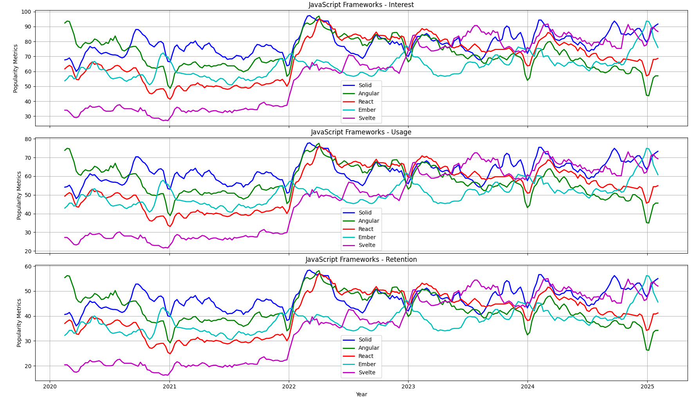

# JavaScript Frameworks Popularity Trends

This project compares JavaScript frameworks over time using Google Trends data. The script fetches and visualizes the popularity of frameworks such as React, Vue, Angular, Svelte, Ember, Backbone, Meteor, Knockout, Alpine.js, Solid, Preact, Lit, Qwik, Hyperapp, and Dojo.



## Features
- Fetches data from Google Trends
- Compares frameworks by **interest, usage, and retention** over time
- Generates and saves CSV data
- Visualizes multiple metrics with matplotlib

## Installation

### Prerequisites
Ensure you have Python installed along with the required dependencies.

```sh
pip install requests pandas matplotlib pytrends
```

## Usage

Run the script to fetch data and generate trend graphs:

```sh
python js_trends.py
```

### Updating Data
The script fetches the latest Google Trends data, so simply rerun the script to update graphs.

## Output
- `js_framework_trends.csv` – Interest data over time
- `js_framework_usage.csv` – Usage data over time
- `js_framework_retention.csv` – Retention data over time
- A visualization comparing **interest, usage, and retention trends** using different line styles.

## Resource

### **Popular Modern Frameworks (2010s - Present)**
1. **React** (2013) - A library for building user interfaces, maintained by Facebook.
2. **Vue.js** (2014) - A progressive framework for building UIs, created by Evan You.
3. **Angular** (2016) - A full-fledged framework by Google, a rewrite of AngularJS.
4. **Svelte** (2016) - A compiler-based framework that shifts work to compile time.
5. **Solid.js** (2018) - A reactive UI library similar to React but with a focus on performance.
6. **Qwik** (2021) - A framework designed for instant-loading web apps.
7. **Astro** (2021) - A modern static site generator with framework-agnostic support.
8. **Next.js** (2016) - A React-based framework for server-rendered and static websites.
9. **Nuxt.js** (2016) - A Vue-based framework for server-side rendering and static sites.
10. **Remix** (2021) - A React-based framework focused on web standards and performance.

---

### **Older Frameworks (2000s - Early 2010s)**
1. **AngularJS** (2010) - The original Angular framework by Google, now deprecated.
2. **Backbone.js** (2010) - A lightweight framework for structuring web apps.
3. **Ember.js** (2011) - A framework for ambitious web applications.
4. **Knockout.js** (2010) - A library for building dynamic UIs with MVVM patterns.
5. **Meteor** (2012) - A full-stack framework for building real-time apps.
6. **Polymer** (2013) - A library for building web components.
7. **Mithril** (2013) - A lightweight framework for single-page applications.
8. **Aurelia** (2015) - A modern framework for building web apps.

---

### **UI Component Libraries**
1. **Material-UI (MUI)** - A React component library based on Google’s Material Design.
2. **Ant Design** - A React UI library with enterprise-level components.
3. **Chakra UI** - A simple and modular component library for React.
4. **Tailwind CSS** - A utility-first CSS framework for building custom designs.
5. **Bootstrap** - A popular CSS framework with pre-built components.

---

### **Static Site Generators**
1. **Gatsby** (2015) - A React-based static site generator.
2. **Hugo** (2013) - A fast static site generator written in Go.
3. **Jekyll** (2008) - A Ruby-based static site generator.
4. **Eleventy (11ty)** (2017) - A simpler static site generator.

---

### **Full-Stack Frameworks**
1. **Meteor** (2012) - A full-stack framework for real-time apps.
2. **Sails.js** (2012) - A Node.js framework for building APIs and real-time apps.
3. **NestJS** (2017) - A progressive Node.js framework for building scalable server-side apps.
4. **Express.js** (2010) - A minimal Node.js framework for building web apps and APIs.

---

### **Specialized Frameworks**
1. **Three.js** - A library for 3D graphics in the browser.
2. **D3.js** - A library for data visualization.
3. **RxJS** - A library for reactive programming using observables.
4. **Redux** - A state management library for JavaScript apps.
5. **GraphQL** - A query language for APIs, often used with Apollo Client.

---

### **Experimental or Emerging Frameworks**
1. **Lit** (2018) - A lightweight library for building web components.
2. **Stencil** (2017) - A compiler for generating web components.
3. **Alpine.js** (2019) - A minimal framework for composing behavior directly in HTML.
4. **Strawberry.js** (2023) - A new framework focused on simplicity and performance.

---

### **Deprecated or Less Popular Frameworks**
1. **Dojo Toolkit** (2004) - A modular framework for building web apps.
2. **YUI** (2005) - Yahoo’s UI library, now deprecated.
3. **MooTools** (2007) - A compact JavaScript framework.
4. **Prototype.js** (2005) - A framework for simplifying DOM manipulation.

---

### **Honorable Mentions**
1. **jQuery** (2006) - A library for DOM manipulation and event handling (not a framework but widely used).
2. **Lodash** - A utility library for JavaScript.
3. **Underscore.js** - A utility library similar to Lodash.


## Contributing
Feel free to submit issues and pull requests for additional improvements.

## License
This project is open-source under the MIT License.
